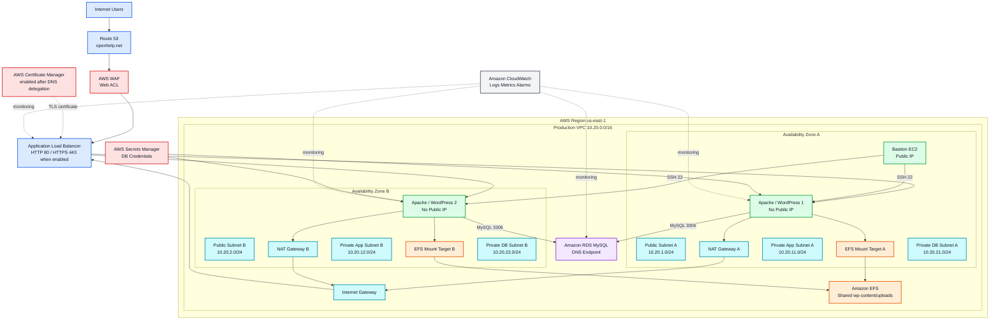
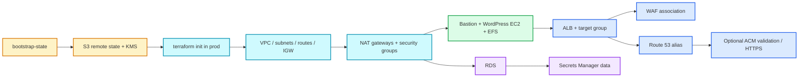
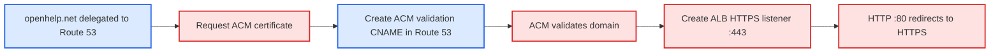
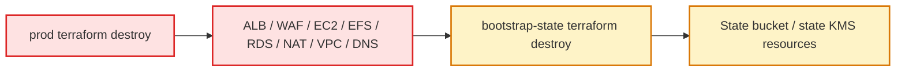

# OpenHelp WordPress AWS Architecture and Terraform Execution Guide

## 1. Purpose

This Terraform project builds an AWS WordPress environment with two Apache/WordPress EC2 instances behind an Application Load Balancer, shared Amazon EFS storage, Amazon RDS MySQL, AWS WAF, Route 53, optional ACM HTTPS, a bastion host, Secrets Manager, CloudWatch, two NAT Gateways, and an S3 remote Terraform state store.

The intended production architecture supports RDS Multi-AZ. The current checked-in `terraform.tfvars` uses Single-AZ RDS and one-day backup retention because the AWS account that produced the deployment error is on the current AWS Free plan, which restricts RDS deployment options. This is a deployment-profile change, not an architectural limitation in the Terraform code.

## 2. Current terraform.tfvars settings

    domain_name         = "openhelp.net"
    route53_zone_name   = "openhelp.net"
    create_route53_zone = true
    enable_https        = false

    db_instance_class        = "db.t3.micro"
    db_backup_retention_days = 1
    db_multi_az              = false

The first apply intentionally uses HTTP. This avoids an ACM validation timeout while the newly created Route 53 hosted zone is not yet authoritative for `openhelp.net`.

## 3. Architecture

## 4. Why the previous apply failed

### Route 53

`example.com` is a documentation/example domain and AWS rejected creating a Route 53 hosted zone for it. The project now uses the real domain:

    openhelp.net

### ACM

ACM DNS validation requires its validation CNAME record to be visible through the authoritative public DNS for the domain. Creating a new Route 53 hosted zone alone does not change the domain registrar's delegation. Therefore the first apply now uses:

    enable_https = false

This creates the infrastructure without blocking on certificate issuance. After `openhelp.net` is delegated to the Route 53 name servers created by this stack, HTTPS can be enabled with one variable change and a normal `terraform apply`.

### RDS Free plan

The failed configuration requested a seven-day backup retention period and Multi-AZ RDS. The current AWS Free plan applies service restrictions and allows only Single-AZ RDS deployment options. The Free-plan profile therefore uses:

    db_backup_retention_days = 1
    db_multi_az              = false

For the intended paid production deployment use:

    db_backup_retention_days = 7
    db_multi_az              = true

## 5. Terraform directory layout

    openhelp-wordpress-prod-terraform/
    |
    +-- bootstrap-state/
    |   +-- main.tf
    |   +-- outputs.tf
    |   +-- providers.tf
    |   +-- terraform.tfvars
    |   +-- variables.tf
    |   +-- versions.tf
    |
    +-- prod/
        +-- alb-dns.tf
        +-- backend.tf
        +-- bastion.tf
        +-- compute.tf
        +-- data.tf
        +-- iam.tf
        +-- monitoring.tf
        +-- network.tf
        +-- outputs.tf
        +-- providers.tf
        +-- security.tf
        +-- ssh-key.tf
        +-- storage-db.tf
        +-- terraform.tfvars
        +-- variables.tf
        +-- versions.tf
        +-- waf.tf

Terraform does not execute `.tf` files sequentially by filename. It loads all `.tf` files in the working directory, builds one dependency graph from references, and creates resources in dependency order.

## 6. Provisioning dependency flow

## 7. Complete deployment commands

### Bootstrap remote state

    cd bootstrap-state
    terraform init
    terraform fmt -recursive
    terraform validate
    terraform plan
    terraform apply

### Deploy production stack

    cd ../prod
    terraform init
    terraform fmt -recursive
    terraform validate
    terraform plan
    terraform apply

No backend copy/paste is required. No `-backend-config` option is required.

## 8. Route 53 and ACM sequence

After the first `prod` apply:

    terraform output route53_name_servers

At the registrar for `openhelp.net`, configure the four Route 53 name servers returned by Terraform.

Verify from Windows:

    nslookup -type=NS openhelp.net

When the public lookup returns the Route 53 name servers, edit:

    enable_https = true

Then:

    terraform plan
    terraform apply

At that point Terraform performs this flow:

## 9. Bastion SSH path

The bastion is in Public Subnet A and receives a public IPv4 address. WordPress EC2 instances remain in private subnets with no public IP.

Security path:

    Internet -> Bastion TCP/22 from approved administrator /32 only
    Bastion SG -> WordPress SG TCP/22

Get the generated command:

    terraform output -raw ssh_to_bastion

WordPress 1 through bastion:

    terraform output -raw ssh_to_wordpress_1

WordPress 2 through bastion:

    terraform output -raw ssh_to_wordpress_2

The private key remains on your workstation; ProxyCommand is used to tunnel SSH through the bastion.

## 10. ALB and WordPress

The ALB is internet-facing and spans both public subnets. The two WordPress instances are registered in one target group on HTTP port 80.

The WordPress security group accepts application traffic only from the ALB security group. It does not expose HTTP directly to the internet.

Check target health:

    aws elbv2 describe-target-health --target-group-arn $(terraform output -raw target_group_arn) --region us-east-1

In PowerShell, first store the ARN if preferred:

    $tg = terraform output -raw target_group_arn
    aws elbv2 describe-target-health --target-group-arn $tg --region us-east-1

## 11. EFS shared WordPress uploads

Both WordPress EC2 servers mount the same EFS filesystem for:

    /var/www/html/wp-content/uploads

Therefore an image uploaded through WordPress server 1 is immediately available when ALB sends a later request to WordPress server 2.

EFS has a mount target in each application AZ. NFS port 2049 is allowed only from the WordPress security group.

## 12. RDS endpoint

WordPress connects to the RDS DNS endpoint returned by:

    terraform output -raw rds_endpoint

This endpoint is a DNS name, not a conventional static VIP.

For the current Free-plan deployment:

    db_multi_az = false

For a paid production deployment:

    db_multi_az = true

When Multi-AZ is enabled, AWS manages database failover while applications continue using the RDS endpoint.

## 13. Security groups

### ALB SG

Inbound:

    TCP 80  from 0.0.0.0/0
    TCP 443 from 0.0.0.0/0

### Bastion SG

Inbound:

    TCP 22 from bastion_allowed_ssh_cidrs

When the list is empty, Terraform discovers the public IP of the machine running Terraform and uses its `/32`.

### WordPress SG

Inbound:

    TCP 80 from ALB SG
    TCP 22 from Bastion SG

### EFS SG

Inbound:

    TCP 2049 from WordPress SG

### RDS SG

Inbound:

    TCP 3306 from WordPress SG

RDS and WordPress EC2 are never opened directly to `0.0.0.0/0`.

## 14. WAF

AWS WAF is associated with the ALB. The Terraform project includes managed protections and a configurable rate limit. The blocked IPv4 CIDR list can be extended in `terraform.tfvars`.

Traffic path:

    User -> Route 53 -> WAF -> ALB -> WordPress

## 15. Secrets Manager

Terraform generates the RDS password and stores database connection data in AWS Secrets Manager. The secret contains the RDS endpoint, port, database name, username, and generated password.

The secret ARN is available with:

    terraform output -raw database_secret_arn

Remember that Terraform-generated secret values are also represented in Terraform state, so the remote state bucket must be treated as sensitive infrastructure.

## 16. CloudWatch

CloudWatch receives application/logging data and contains alarms for important infrastructure conditions such as unhealthy ALB targets and RDS CPU utilization.

## 17. NAT gateways

There is one NAT Gateway per AZ:

    Private App Subnet A -> NAT Gateway A -> Internet Gateway
    Private App Subnet B -> NAT Gateway B -> Internet Gateway

The private WordPress EC2 instances use these routes for outbound package downloads and updates without receiving public IP addresses.

## 18. Useful outputs

    terraform output

Specific outputs:

    terraform output -raw website_url
    terraform output -raw alb_dns_name
    terraform output -raw rds_endpoint
    terraform output -raw bastion_public_ip
    terraform output -raw ssh_to_bastion
    terraform output -raw ssh_to_wordpress_1
    terraform output -raw ssh_to_wordpress_2
    terraform output route53_name_servers

## 19. Complete destroy procedure

Destroy the application stack first:

    cd prod
    terraform destroy

Then destroy the state bootstrap stack last:

    cd ../bootstrap-state
    terraform destroy

Destroy order:

Never destroy the remote-state infrastructure before the production stack because Terraform needs the production state during destroy.

## 20. Moving from Free plan to full production

After upgrading the AWS account plan, change at minimum:

    db_multi_az              = true
    db_backup_retention_days = 7
    enable_https             = true

Also consider increasing EC2 and RDS instance sizes according to load testing and enabling stronger deletion/final-snapshot protections for the database.
